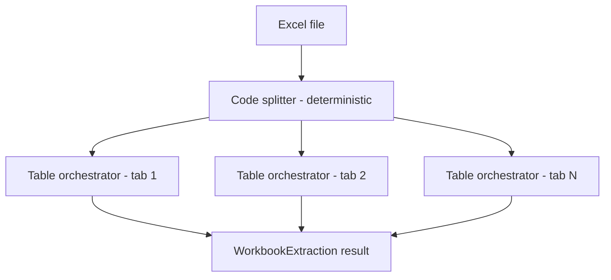
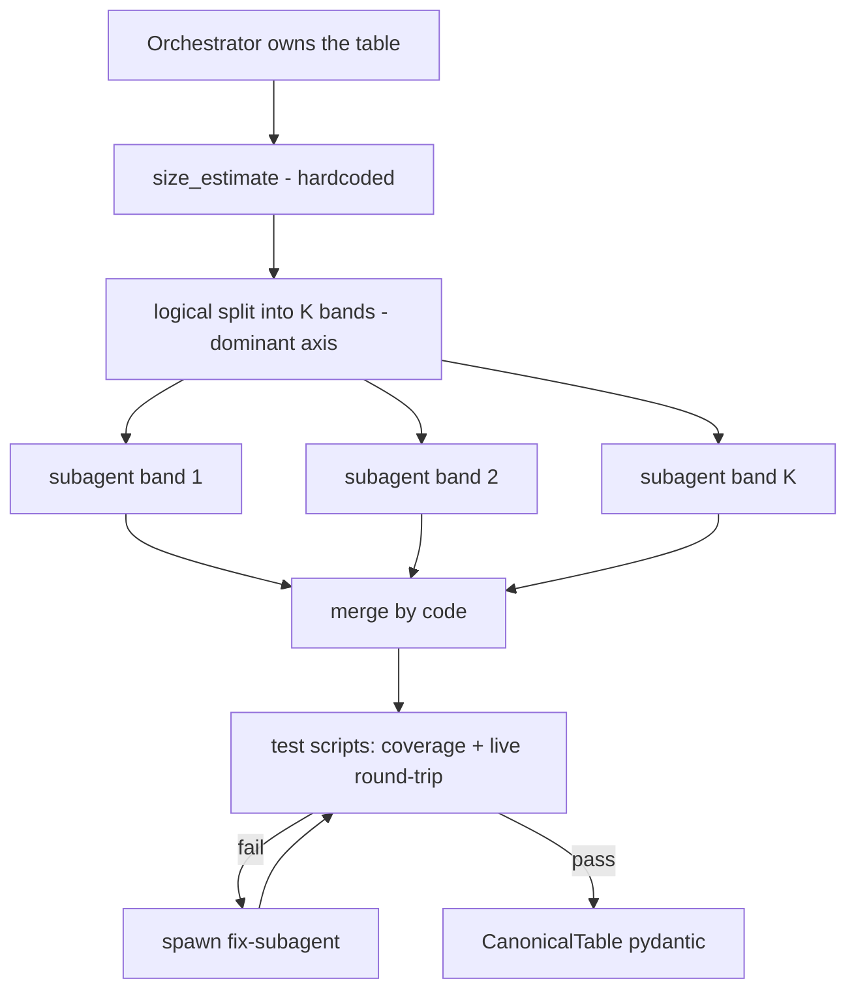

# MCG Swarm — Build Spec (v2: Independent Canonical Tables)

**Purpose of this document.** A self-contained brief for building the MCG (Model-Card
Generation) swarm **from scratch** in a coding session. It states what to build, the
contracts and data models, the algorithms, the resolved design decisions, how to test
it, and the success criteria that define "done." The authoritative design narrative is
[`SWARM-v2-canonical-tables.md`](SWARM-v2-canonical-tables.md); this spec operationalizes
it and bakes in the decisions made on 2026-06-22.

Target language: **Python 3.10+**, Pydantic v2. Reuse the existing `eval/` harness as the
in-loop tester and `eval/util.py::safe_eval` as the formula evaluator.

---

## 1. Product context

DIM is a **pricing** product. The MCG swarm is a **standalone extraction service**: it
ingests a customer's Excel pricing workbooks and turns each workbook into a queryable
`WorkbookExtraction` — a set of **independent canonical tables**, each with a live,
directly-addressable extraction layer and its own intra-table formulas. This is the
structured substrate that pricing logic later runs on.

For this build, **the downstream consumer of the extraction is out of scope.** The
deliverable is the swarm that reliably produces correct, fully-addressable canonical
tables from real-world-messy Excel. (Model cards — human-authored metric definitions —
are a separate, related artifact; see §12.)

---

## 2. What the swarm does (one paragraph)

Given an Excel file, deterministically split it into one table per tab; hand each table
to its own orchestrator; within an orchestrator, fan a large table out to subagents
purely for scale; merge the subagent reports by code into a single `CanonicalTable`
whose extraction layer can resolve **any** data point directly by key/coordinate; test
that layer against the live file; and return a `WorkbookExtraction` of independent
canonical tables with **no cross-table dependencies**. Canonical tables capture
**structure, not data** — all lookups read the live file, so changed inputs are always
reflected.

---

## 3. Core principles (invariants the build must honor)

1. **One table per tab.** Each worksheet is assumed to hold a single table with a clear
   header row. The file → tables split is mechanical (see §5 for the messy-tab fallback).
2. **Independence.** Each table is analyzed and emitted on its own. No table references
   another. Intra-table formulas are kept; cross-table formulas do not exist in v2.
3. **Canonical = structure, not data.** A canonical table standardizes the table's shape
   (columns, types, units, row-key scheme, region, orientation). It does **not** copy
   values. Lookups run against the original live file.
4. **Whole-table addressability (load-bearing invariant).** However a table is fragmented
   internally for analysis, the merged extraction layer must let a caller resolve *any*
   data point directly by key/coordinate — **no scanning, no search, no LLM in the lookup
   path.** Fragmentation is an implementation detail; total, direct coverage is the contract.
5. **Fully automated.** There is **no human confirmation gate inside the swarm** (see §11).
   The automated test suite is the only in-loop quality gate.

---

## 4. Architecture

File-level fan-out — deterministic split, independent per-table orchestrators:



Inside one table orchestrator — size-driven fan-out, merge, test, repair:



### Tier 0 — Code splitter (deterministic, no LLM by default)

Opens the file, enumerates tabs, and for each tab locates the single table's header row
and bounding region (header detection + extent). Emits one `(sheet, region, header)`
handle per table. Runs every time; no model calls on the happy path. The messy-tab
fallback (§5) is the only place an LLM may enter Tier 0.

### Tier 1 — Per-table orchestrator (one per tab, parallel)

Owns exactly one table. Responsibilities:

- **Size estimate** (pure, deterministic; §10) → decide axis + `K` subagents.
- **Logical split** — divide the table into `K` bands **by reference** (a band is a
  `(sheet, row_start, row_end | col_start, col_end, header)` brief). Data is never copied.
- **Dispatch** each band to a subagent.
- **Merge (code-first; §9)** — combine `SegmentReport`s into one `CanonicalTable`.
- **Test (§11)** — run coverage + live round-trip on the merged extraction layer.
- **Repair** — on test failure or merge conflict, spawn a focused fix-subagent with the
  failing cases; re-test; bounded retries; otherwise return the table with `errors`
  populated and **not** marked passing (never return a table whose scripts silently fail).
- **Return** a `CanonicalTable`.

### Tier 2 — Subagents (stateless workers, parallel within a table)

Each receives one band brief and returns a `SegmentReport` (see §8): the canonical
structure it observes, intra-band formulas (structurally, so they can be replayed), a
contextual description, and anomalies it could not resolve. Subagents do not copy data
and do not finalize names; the orchestrator owns reconciliation.

---

## 5. Assumption enforcement — messy tabs *(decision)*

When a tab violates "one clean table with a header" (none, several, a pivot, or a
title-banner offset):

1. **Deterministic detection first.** Run the mechanical header/region detector.
2. **LLM header-structure fallback.** If the deterministic pass is ambiguous (no single
   clear header, multiple candidate tables, pivot shape, or an offset banner), escalate to
   an LLM that analyzes the header structure and attempts to resolve a single clean table +
   header row + extent.
3. **Fail loud if too complicated.** If the LLM cannot confidently resolve a single clean
   table, **fail loud for that tab**: emit a `CanonicalTable` stub with `errors` populated
   and **continue** processing the other tabs. Never silently guess, and never block the
   whole file on one bad tab.

---

## 6. Data model (Pydantic v2)

```python
class ColumnSpec(BaseModel):
    name: str
    dtype: Literal["number", "string", "boolean", "date"]
    unit: str | None = None
    role: Literal["key", "value", "computed"] = "value"   # computed => has a formula

class OperandBinding(BaseModel):
    name: str                    # identifier used in `expression`, e.g. "Gross"
    source: Literal["column", "cell", "range", "param"]
    ref: str                     # column name | A1 cell | A1 range | external param name

class TableFormula(BaseModel):
    target: str                  # column name or cell/row pattern the formula fills
    expression: str              # named-operand arithmetic, e.g. "Gross - Discount"
    operands: list[OperandBinding]
    ast: dict | None = None      # pre-parsed AST (compiled, cached form)

class ExtractionRef(BaseModel):
    script_name: str             # module/object exposing query(row, column)
    row_key: list[str]           # column(s) identifying a row (or [] => positional)
    notes: str | None = None

class CanonicalTable(BaseModel):
    table_id: str
    sheet: str
    region: str                  # A1 bounding box in the live file
    header_row: int
    orientation: Literal["vertical", "transposed"] = "vertical"
    columns: list[ColumnSpec]
    formulas: list[TableFormula] = []      # formulas used *inside* this table
    description: str
    extraction: ExtractionRef
    provisional_notes: list[str] = []
    errors: list[str] = []                 # populated => table did not pass / messy-tab fail

class WorkbookExtraction(BaseModel):       # final swarm result (one per file)
    workbook: str
    sheets: list[str]
    tables: list[CanonicalTable]           # independent; no cross-table edges
    generator_version: str
    errors: list[str] = []

class SegmentReport(BaseModel):            # one per subagent band
    band: str                              # the brief this report answers
    columns: list[ColumnSpec]
    formulas: list[TableFormula] = []
    description: str
    anomalies: list[str] = []

class ExtractedValue(BaseModel):           # what query() returns
    value: Any
    dtype: str
    unit: str | None = None
    sheet: str
    cell_ref: str                          # provenance, A1
    is_computed: bool = False
```

---

## 7. The extraction layer — `query(row, column)` *(design clarification)*

The extraction layer is the realization of principle #4. **It is not LLM-generated code
and contains no search.** The orchestrator builds, per table, a deterministic
**ExtractionIndex**:

- `row_key value(s) -> physical row` (a dict; positional fallback when `row_key == []`),
- `column name -> physical column` (from the header), and
- a thin **live reader** that opens the workbook and returns the cell at the resolved
  `(row, col)`.

Contract (unchanged from prior work):

```
query(row, column) -> ExtractedValue
```

- Pure with respect to inputs; **reads the live file** so overrides/edits are honored.
- **Fail-loud** on unknown row keys or columns (raise; do not return None silently).
- O(1) key/column resolution — no scanning, no LLM.
- For `role="computed"` columns it returns the live cached value by default; the what-if
  path (§8) recomputes from the captured `TableFormula` instead.

Whether the merged layer is one index (uniform table) or a router over per-band indices
is an implementation choice — the only requirement is the **whole-table addressability
invariant**.

---

## 8. Formula storage & execution

Rule of thumb: **separate the expression from the data.** Never store an executable code
string. Two layers on `TableFormula`:

1. **Authoring form** — a named-operand expression string over operand *names*
   (`"Gross - Discount"`, `"SUM(net_range)"`).
2. **Binding** — `operands: list[OperandBinding]` mapping each name to a `column`
   (resolved at the current row), a fixed `cell`, a `range` (list, for aggregates), or an
   external `param` (what-if input).

At build time, parse the expression **once** into a validated AST (stored in `ast`);
runtime never re-parses, and the operand set is checked against the bindings. The AST is a
small JSON tree, e.g. `{"op": "-", "args": [{"var": "Gross"}, {"var": "Discount"}]}`.

Execution is one function over a plain dict (the dict **is** the data-insertion point):

```python
def evaluate(formula: TableFormula, env: dict[str, float | list]) -> float:
    return safe_eval(formula.expression, env, funcs=FORMULA_FUNCS)

def build_env(formula, row_key, query, overrides=None):
    env = {}
    for op in formula.operands:
        if op.source == "column":  env[op.name] = query(row_key, op.ref).value
        elif op.source == "cell":  env[op.name] = query_cell(op.ref).value
        elif op.source == "range": env[op.name] = [c.value for c in query_range(op.ref)]
        elif op.source == "param": env[op.name] = (overrides or {})[op.name]
    if overrides:
        env.update(overrides)      # what-if: replace any operand by name
    return env
```

**Safe evaluator + allowlist.** Reuse `eval/util.py::safe_eval`, an AST-walking evaluator
with a strict allowlist, extended with a function table:

- operators: `+ - * / ** //`, unary `±`, comparisons, and `IF(cond, a, b)`;
- `FORMULA_FUNCS`: `SUM, AVG, MIN, MAX, COUNT, ABS, ROUND` over scalars/lists.

Anything outside the allowlist (attribute access, unknown calls, arbitrary Python) raises
at parse/eval time. **No `eval()`, no `exec()`.**

---

## 9. Merge (code-first)

For a row-band split of a uniform table every band reports the same structure, so merge is
mostly assertion + union:

- **Structure** — assert all bands agree on columns/types/units; the merged structure is
  that agreement. Disagreement = anomaly → fix-subagent (likely the table isn't actually
  uniform → may trigger the §5 messy-tab path).
- **Formulas** — union across bands, dedupe by `(target, expression)`.
- **Descriptions** — compose the section descriptions into one table description.
- **Extraction** — produce the index/layer that covers the whole table (§7).

LLM merge is reserved for genuine conflicts the code path can't reconcile.

---

## 10. `size_estimate` & hybrid fan-out *(decision)*

`size_estimate(table)` is a **pure, deterministic** function returning `rows`, `cols`,
`cell_count`. Thresholds (tunable constants):

```
ROWS_PER_AGENT = 5_000
COLS_PER_AGENT = 40        # placeholder for wide-table pressure; tune on real cases
K_MAX = 16
```

**Hybrid by dominant axis:** pick the axis under the most pressure, then size `K`.

```python
row_pressure = rows / ROWS_PER_AGENT
col_pressure = cols / COLS_PER_AGENT
if max(row_pressure, col_pressure) <= 1:
    K, axis = 1, "row"                      # small table, no fan-out
elif row_pressure >= col_pressure:
    axis = "row";  K = min(ceil(row_pressure), K_MAX)   # K row bands of <=5,000 rows
else:
    axis = "col";  K = min(ceil(col_pressure), K_MAX)   # K column groups
```

Bands are described **by reference** (briefs), never by copying data. The 100k-row
benchmark file (`enterprise_transactions`, ~2.2M cells) must therefore fan out to **≥2
row-band subagents** for its primary sheet.

---

## 11. Testing — the only in-loop gate *(decision)*

The swarm is **fully automated**. There is **no human confirmation gate inside the swarm**;
the user validates the finished `WorkbookExtraction` once, externally, after a run
completes — that is outside the swarm's control flow. Inside the orchestrator, before
returning a table, run a deterministic suite against the **live file**:

- **Coverage** — every `(row_key, column)` implied by the header is addressable; assert no
  gaps and no out-of-table addresses (the whole-table addressability invariant, checked
  directly).
- **Round-trip** — for a sample (every column, each band boundary, the extremes, plus a
  random subset), call `query()` and assert the result is non-null, has the declared
  dtype/unit, and equals the value read directly from the file at that coordinate.
- **Computed cells** — for `role="computed"` columns, recompute via `evaluate(...)` from
  the captured formula and live operands and assert it matches the cell.
- **Failure path** — failing cases go to a fix-subagent; re-test; bounded retries; else the
  table is returned with `errors` populated and **not** marked passing.

This is the same check the `eval/` pipeline performs, so **reuse that harness as the
in-loop tester** rather than reimplementing it.

---

## 12. Relationship to model cards (kept, separate)

Model cards (`examples/cards/*.json`, schema in
[`MODEL_CARD_SCHEMA.md`](MODEL_CARD_SCHEMA.md)) are **human-authored** metric definitions
(formula + variables + business_logic). They are **not** produced by the swarm. A card's
variables resolve against canonical tables via `query()`. Keep card variables
**single-table** — v2 canonical tables carry no cross-table dependencies. The swarm's job
ends at producing correctly-queryable tables; cards consume them.

---

## 13. Explicitly removed vs v1 (do **not** build these)

- The unified `ModelCard`-per-category produced by the swarm, and the cross-table
  `DependencyGraph` (`FormulaNode`s composing `VariableNode`s across tables).
- `business_logic`-driven variable/formula **synthesis across tables**.
- The scout → reconciliation → confirmation-gate flow. v2 has **one owner per table** from
  the start, and **no human gate** inside the swarm.

---

## 14. Eval pipeline (how to test the build)

The `eval/` harness already benchmarks the right things; **wire the swarm to it** rather
than building a new tester. It never imports the swarm — it talks to an `EvalAdapter`
(`eval/adapters/base.py`). Implement `eval/adapters/swarm_adapter.py::SwarmAdapter`:

- `prepare(workbook_path, label)` — run the swarm once; cache the produced
  `WorkbookExtraction` (its `CanonicalTable`s) on `self`. Do **not** read answers from
  `label`.
- `table_region` — A1 region of a canonical table (from the deterministic splitter).
- `extract` — call the table's `query(row, column)`; return `ExtractedValue.value`.
- `answer_semantic` — NL → (table, column, row) → value.
- `detected_measures` — one `DetectedMeasure` per canonical column/field.
- `compute_formula` — evaluate an **intra-table** formula end-to-end (no cross-table graph).

Run: `python eval/run_benchmark.py --adapter swarm`. The **oracle** adapter scores ~100%
(proves labels + scorer); the swarm adapter gets a per-capability, per-tier, per-file
breakdown.

**Capabilities scored:** table boundaries (cell-IoU ≥ 0.999), value extraction, semantic
extraction, intra-table formula compute, measure detection (P/R/F1).

**Test corpus:** 19 deterministic synthetic workbooks — 15 graded (easy/medium/hard) + 3
extreme (live formulas / cross-sheet refs / named ranges, recalculated by LibreOffice) + 1
extreme-scale (`enterprise_transactions`, ~100k-row × 22-col, ~2.2M cells) that forces
≥2 subagents. `eval/verify.py` re-reads every xlsx to prove labels correct.

**Pending eval migration (per the v2 doc; track but the oracle stays green meanwhile):**
scope formula scoring to intra-table only, drop `business_logic` as a driver, and add a
whole-table **coverage-invariant** check to the scorer.

---

## 15. Suggested module layout

```
mcg_swarm/
  __init__.py
  schemas.py          # §6 pydantic models
  splitter.py         # Tier 0: enumerate tabs, deterministic header/region detection
  header_llm.py       # §5 LLM header-structure fallback + fail-loud
  size_estimate.py    # §10 pure size_estimate + axis/K decision
  orchestrator.py     # Tier 1: split -> dispatch -> merge -> test -> repair -> return
  subagent.py         # Tier 2: band brief -> SegmentReport
  merge.py            # §9 code-first merge
  extraction.py       # §7 ExtractionIndex + query() live reader (no LLM/search)
  formulas.py         # §8 AST parse, build_env, evaluate, FORMULA_FUNCS (reuse safe_eval)
  testing.py          # §11 in-loop suite (reuse eval/ harness)
  runner.py           # run_swarm(workbooks: dict[str, str]) -> WorkbookExtraction
tests/
  ...                 # unit tests per module + golden runs on eval workbooks
```

Reuse `eval/util.py::safe_eval` from `formulas.py`; reuse the `eval/` harness from
`testing.py` and the `SwarmAdapter`.

---

## 16. Build milestones (phased)

1. **Schemas + formula engine** — `schemas.py`, `formulas.py` (AST parse, `build_env`,
   `evaluate`, allowlist), with unit tests incl. what-if overrides.
2. **Tier 0 splitter (deterministic)** — header/region detection + extent on easy/medium
   workbooks; emit `(sheet, region, header)` handles.
3. **Extraction layer** — `ExtractionIndex` + `query()`; pass coverage + round-trip on
   easy/medium tables.
4. **Tier 1 + Tier 2 + merge** — `size_estimate` (hybrid axis), reference-band split,
   subagent `SegmentReport`, code-first merge; validate on hard + the 100k file (≥2 bands).
5. **In-loop test suite + repair** — wire `testing.py` to the eval harness; fix-subagent
   loop with bounded retries; `errors` on persistent failure.
6. **Messy-tab path** — `header_llm.py` fallback, then fail-loud per-tab.
7. **Benchmark** — implement `SwarmAdapter`; run `--adapter swarm`; iterate to target
   scores; keep `--adapter oracle` ~100% throughout.

---

## 17. Success criteria (definition of done)

**Functional**

- [ ] `run_swarm({"main": path})` returns a schema-valid `WorkbookExtraction`; every
      `CanonicalTable` is independent (no field references another table).
- [ ] Tier 0 splitter is deterministic and emits exactly one table handle per clean tab;
      identical input → identical handles, no model calls on the happy path.
- [ ] Messy tabs follow §5: deterministic → LLM header analysis → fail-loud with `errors`
      populated, **other tabs still processed** (one bad tab never fails the file).
- [ ] `size_estimate` is pure/deterministic: `ROWS_PER_AGENT=5_000`, `K_MAX=16`, hybrid
      dominant-axis selection; the 100k-row file fans out to **≥2** subagents.
- [ ] Logical split is **by reference** — no test observes table data being copied/rewritten.

**Extraction correctness (the load-bearing part)**

- [ ] **Whole-table coverage invariant:** for every table, every `(row_key, column)`
      implied by the header resolves via `query()` with **no search and no LLM** in the
      lookup path; coverage test reports zero gaps and zero out-of-table addresses.
- [ ] **Round-trip:** sampled `query()` results equal the live-file value at that
      coordinate, with correct `dtype`/`unit` and A1 provenance; unknown keys/columns
      **raise** (fail-loud), never return null silently.
- [ ] **Live lookups:** editing an input cell in the file changes `query()` output without
      re-running the swarm (no data is cached in the canonical table).

**Formulas**

- [ ] Formulas stored as named-operand expression + bindings + cached AST; **no executable
      code strings**; evaluation uses the allowlisted `safe_eval` (no `eval`/`exec`).
- [ ] `role="computed"` cells recompute via `evaluate(...)` and match the live cell.
- [ ] What-if: overriding an operand by name changes the computed result correctly.

**Automation & robustness**

- [ ] **No human gate** anywhere in the swarm's control flow; the test suite is the only
      in-loop gate; a table that can't pass is returned with `errors` and not marked passing.
- [ ] Fix-subagent repair loop is bounded; the swarm always terminates and never raises out
      of an unhandled subagent failure.

**Benchmark**

- [ ] `SwarmAdapter` implemented; `python eval/run_benchmark.py --adapter swarm` runs all 19
      workbooks end-to-end and emits the JSON + HTML scorecard.
- [ ] `--adapter oracle` remains ~100% (harness integrity preserved).
- [ ] Target swarm scores agreed from the first full run (table boundaries IoU, value &
      semantic extraction, intra-table formula compute, measure detection F1) — set the bar
      after seeing the baseline, then ratchet.

---

## 18. Assumptions & constants (confirm / tune)

- Extraction layer is a **deterministic index + live reader**, not LLM-generated per-table
  code (§7). Confirm if a different realization is wanted.
- `COLS_PER_AGENT = 40` is a placeholder; tune when a real wide-table case appears.
- Downstream consumer of `WorkbookExtraction` is **out of scope** for this build.
- Python + Pydantic v2; reuse `eval/util.py` and the `eval/` harness.
