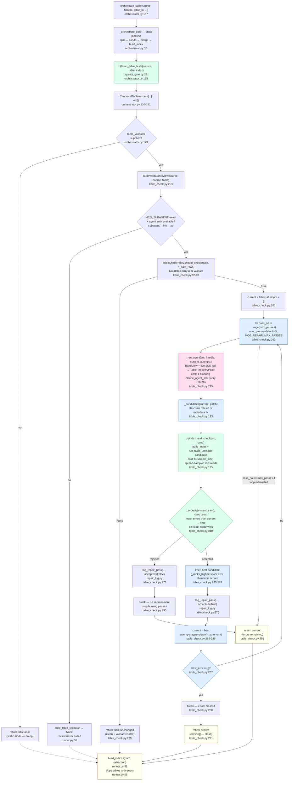

# Error Recovery — `TableValidator.review`

Bounded multi-pass ReAct repair loop that runs after static extraction whenever a
table has errors (or validation is enabled), verify-before-accept at every step.

- **Entry:** `TableValidator.review(source, handle, table)` — `table_check.py:253`
- **Returns:** `CanonicalTable` (errors cleared or reduced); never raises — any
  exception returns the original table unchanged (`table_check.py:292-293`)
- **Consumed by:** `orchestrator.py:180` (`orchestrate_table` calls
  `table_validator.review`); downstream `runner.py:58` (`build_indices` skips
  tables that still carry errors)

## Flow

## Phase reference

| Step | What it does | Cost | Source |
|---|---|---|---|
| `_orchestrate_core` | Static split→band→merge→index pipeline | O(bands × rows) openpyxl reads | `orchestrator.py:36` |
| `§6 run_table_tests` | Deterministic quality gate; stamps `errors` | 1 workbook open + spread sample | `orchestrator.py:135`, `quality_gate.py:22` |
| `TableCheckPolicy.should_check` | Gate entry: errors present OR validate=True; no size cap | O(1) | `table_check.py:92` |
| `_run_agent` | Live ReAct SDK call; builds BandView over table region; seeds prior attempts | ~50-70s blocking network | `table_check.py:295` |
| `_candidates` | Structural rebuild (header_row/span + full cols) or metadata patch; tries agent span, span=1, original span | O(1) | `table_check.py:193` |
| `_reindex_and_check` | Re-runs `build_index` + `run_table_tests` on candidate; spread-sampled gate read | O(sample_size) random row reads | `table_check.py:125` |
| `_accepts` | Strictly fewer errors → accept; tie-break: higher year-aware label score; never regresses | O(cols) | `table_check.py:310` |
| `log_repair_pass` | Structured log: pass#, errors before/after, accepted flag, patch summary, latency | O(1) | `repair_log.py` |
| `build_indices` | Rebuilds ExtractionIndex for each clean table; silently skips error tables | O(rows) per clean table | `runner.py:51`, `runner.py:58` |

## Design notes

- **Always-on when react+auth; no-op otherwise.** `build_table_validator` in
  `mcg_swarm/subagent/__init__.py` returns `None` unless `MCG_SUBAGENT=react` and
  agent auth is available (`ANTHROPIC_API_KEY` or `claude` CLI). `orchestrate_table`
  only calls `review` when `table_validator is not None` (`orchestrator.py:179`).
- **Loop is strictly bounded.** At most `max_passes` iterations (default 3,
  set via `TableCheckPolicy.max_passes`). Early-exit on either: errors cleared
  (`break` at `table_check.py:288`) or no improvement at all (`break` at
  `table_check.py:290`). The loop never wastes a pass on a no-op.
- **Verify-before-accept never regresses.** `_accepts` enforces monotone error
  reduction — a candidate with more errors than the current best is silently dropped.
  Tie-breaking uses the year-aware label score (`_label_score`/`_is_label`) to
  recover a gate-blind header-span over-detection without accepting an unverifiable
  lateral change (`table_check.py:116-120`).
- **Sampling bounds gate cost.** `_reindex_and_check` calls `run_table_tests` which
  uses `select_sample` (`sampling.py:18`) for tables above `MCG_SAMPLE_FULL_THRESHOLD`
  (default 300 rows) — reads a stride-spread ~300-row sample rather than the full
  table. Total per-table gate cost is ≤ passes × sample_size reads (max 900 today).
  The `WorkbookSource` seam (`source.py`) is where a streaming reader removes this
  without changing extraction logic (see `OPTIMIZATIONS.md` #1 cost note).
- **Structural candidates try multiple spans.** The agent is unreliable at
  header-span arithmetic; `_structural_candidates` tries its span, span=1, and the
  original span, letting `_accepts` pick the winner (`table_check.py:168`).
- **Never raises.** The outer `try/except` at `table_check.py:292` catches all
  exceptions and returns the original table — the pipeline never breaks on a
  validator failure.
