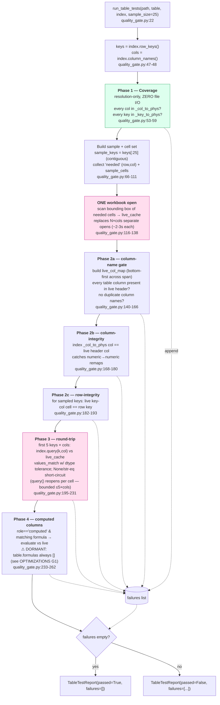

# Table Test Reports — `run_table_tests`

How the in-loop quality gate validates an extracted table and produces a
`TableTestReport`. This is the deterministic check the orchestrator runs at §6
before accepting a table.

- **Entry:** `run_table_tests(path, table, index, sample_size=25)` — `mcg_swarm/quality_gate.py:22`
- **Returns:** `TableTestReport(passed: bool, failures: list[str])` — `quality_gate.py:14-17`
- **Consumed by:** `orchestrator.py:134-135` (sets `CanonicalTable.errors`), and indirectly by the
  table-level ReAct validator's verify-before-accept (fewer errors ⇒ accept).

## Flow

## Phase reference

| Phase | Checks | File I/O | Source |
|---|---|---|---|
| 1 — Coverage | every column & row key resolves in the index maps | **none** (in-memory) | `quality_gate.py:53-59` |
| (scan) | batch-read all needed cells in one open | **1 open**, bounding box only | `quality_gate.py:116-138` |
| 2a — Column-name | live header contains each table column; no dup names | from cache | `quality_gate.py:140-166` |
| 2b — Column-integrity | index col == live header col (no silent remap) | from cache | `quality_gate.py:168-180` |
| 2c — Row-integrity | sampled key cell matches the resolved key | from cache | `quality_gate.py:182-193` |
| 3 — Round-trip | `index.query()` value == independent live read | ≤ 5×cols opens (bounded) | `quality_gate.py:195-231` |
| 4 — Computed | re-evaluate formula vs live cell | from cache | `quality_gate.py:233-262` |

## Design notes

- **Accumulate, don't short-circuit.** All phases run and append to one shared
  `failures[]`; the verdict is simply `passed = not failures` (`quality_gate.py:264`).
  A table reports *every* problem in one pass, not just the first.
- **One open for correctness checks.** The single batched scan (`quality_gate.py:116-138`)
  replaced per-cell opens that cost ~2-3s each on large files — the main perf fix that
  unblocked 100k-row tables.
- **Sampling keeps it cheap.** `sample_size=25` *contiguous first* keys keep the scan
  bounding box small; round-trip is further capped to `ROUND_TRIP_SUBSAMPLE=5`
  (`quality_gate.py:201`). Coverage (Phase 1) is exhaustive because it's free (no I/O).
- **Phase 4 is currently dormant** — `table.formulas` is always `[]` and static never
  sets `role="computed"`, so the computed-column check never fires. See
  `OPTIMIZATIONS.md` G1 (formula extraction gap).
